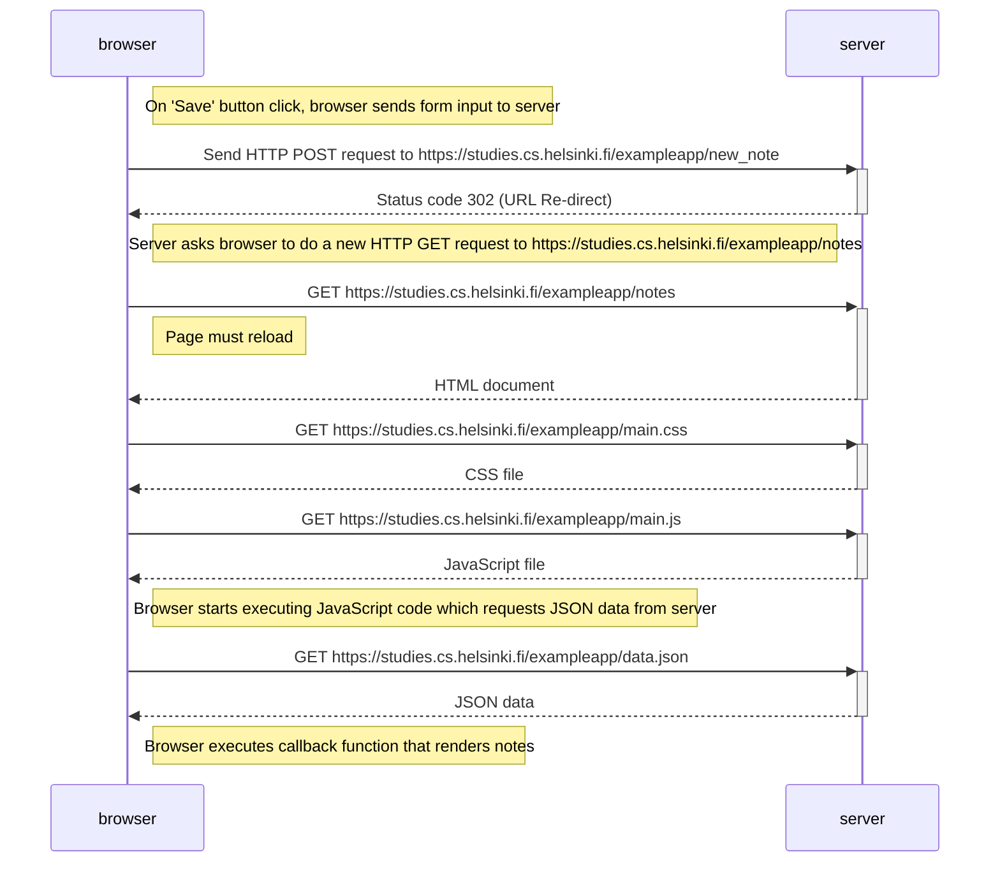

```mermaid
sequenceDiagram
    participant browser
    participant server

    Note right of browser: On 'Save' button click, browser sends form input to server
    browser->>+server: Send HTTP POST request to https://studies.cs.helsinki.fi/exampleapp/new_note
    server-->>-browser: Status code 302 (URL Re-direct)
    Note left of server: Server asks browser to do a new HTTP GET request to https://studies.cs.helsinki.fi/exampleapp/notes
   
    
    browser->>+server: GET https://studies.cs.helsinki.fi/exampleapp/notes
    Note right of browser: Page must reload
    server-->>-browser: HTML document

    browser->>+server: GET https://studies.cs.helsinki.fi/exampleapp/main.css
    server-->>-browser: CSS file

    
    browser->>+server: GET https://studies.cs.helsinki.fi/exampleapp/main.js
    server-->>-browser: JavaScript file
    Note right of browser: Browser starts executing JavaScript code which requests JSON data from server

    browser->>+server: GET https://studies.cs.helsinki.fi/exampleapp/data.json
    server-->>-browser: JSON data 
    Note right of browser: Browser executes callback function that renders notes

```

