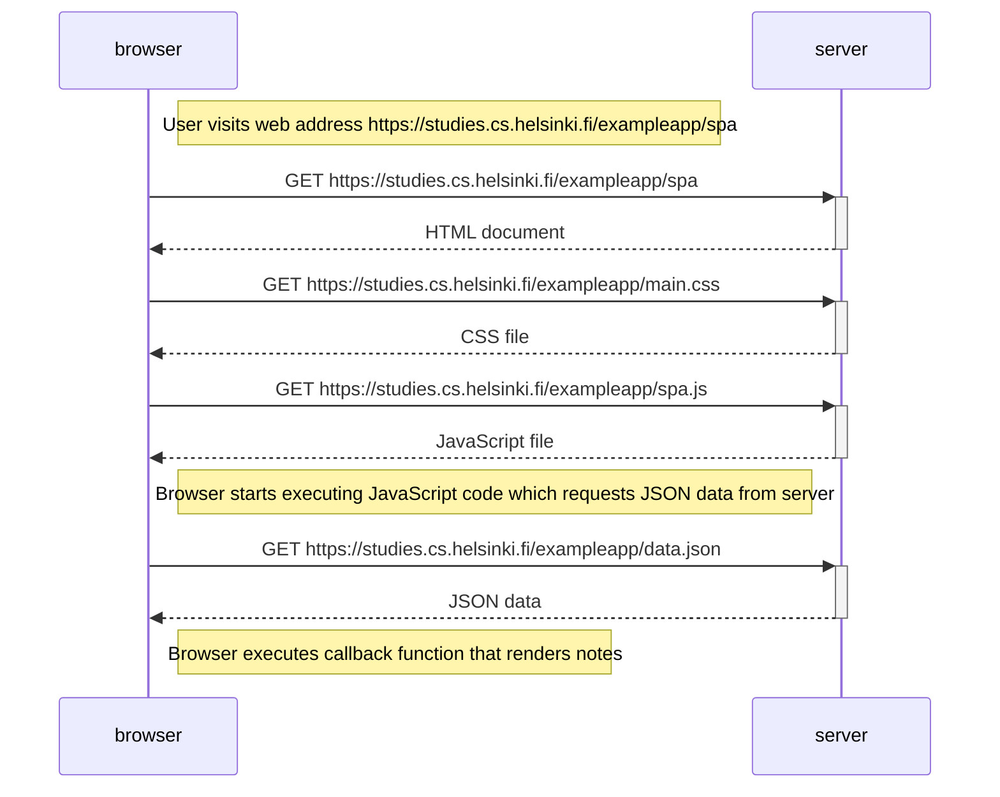

```mermaid
sequenceDiagram
    participant browser
    participant server

    Note right of browser: User visits web address https://studies.cs.helsinki.fi/exampleapp/spa
    browser->>+server: GET https://studies.cs.helsinki.fi/exampleapp/spa
    server-->>-browser: HTML document

    browser->>+server: GET https://studies.cs.helsinki.fi/exampleapp/main.css
    server-->>-browser: CSS file

    browser->>+server: GET https://studies.cs.helsinki.fi/exampleapp/spa.js
    server-->>-browser: JavaScript file

    Note right of browser: Browser starts executing JavaScript code which requests JSON data from server

    browser->>+server: GET https://studies.cs.helsinki.fi/exampleapp/data.json
    server-->>-browser: JSON data 
    Note right of browser: Browser executes callback function that renders notes
```