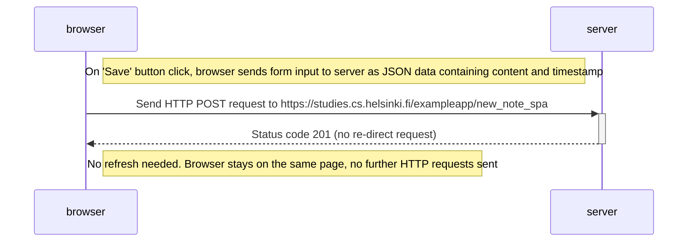

```mermaid
sequenceDiagram
    participant browser
    participant server
    
    Note right of browser: On 'Save' button click, browser sends form input to server as JSON data containing content and timestamp
    browser->>+server: Send HTTP POST request to https://studies.cs.helsinki.fi/exampleapp/new_note_spa
    server-->>-browser: Status code 201 (no re-direct request)
    Note right of browser: No refresh needed. Browser stays on the same page, no further HTTP requests sent 
```